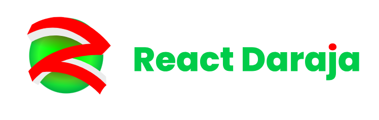

# React Daraja Docs

The official documentation website of the [React Daraja library](https://github.com/amosmachora/react-daraja).

# About

React Daraja is a typesafe Javascript library designed to simplify interactions with the Safaricom Daraja API. This library is suitable for both Node.js and React environments, allowing developers to seamlessly integrate M-Pesa payments into their applications.

This repo is a NextJS project that defines the usage , guides amd overall API of the react daraja repo.

To contribute just fork your copy of this repo and submit a PR.
